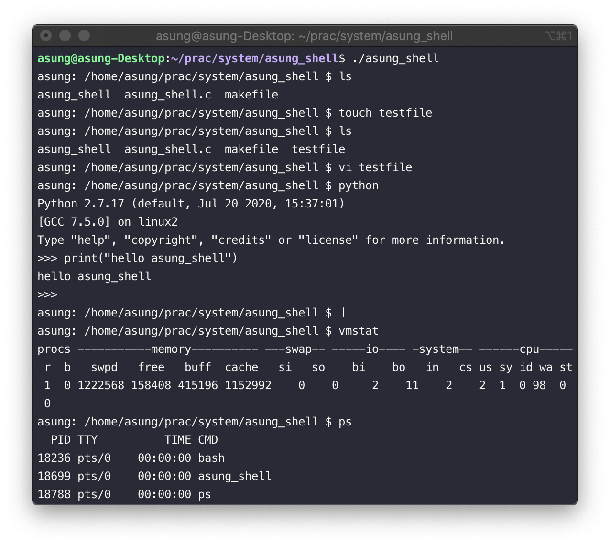

# asung shell

This is simillar to Bourne shell, but it does not perform like interpreter. JUST commander shell

---------------------------------
 

* Can use All system Command based execfile( ls, vmstatm, sudo ...etc ), and "cd"
* Can generate Signal,
* Enter "ctrl + D"(EOF) to exit shell
 
 

## Iamage

